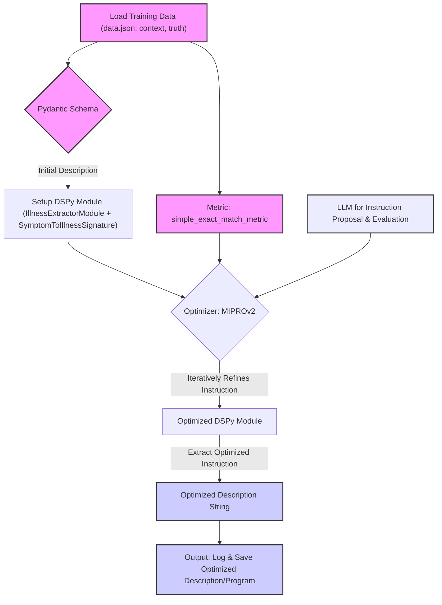

# Hypothesis: Optimizing Pydantic Field Descriptions with DSPy

This document outlines the hypothesis and methodology for using the DSPy framework to optimize the `description` strings within Pydantic schema fields. The goal is to improve the accuracy of Large Language Models (LLMs) in extracting structured data from text, particularly when these descriptions guide the LLM.

## 1. Core Hypothesis

**We hypothesize that by treating Pydantic field descriptions as optimizable instructions, DSPy can systematically refine these descriptions to significantly enhance the accuracy and reliability of LLM-based data extraction.**

Instead of manually iterating on prompt phrasing for each field, DSPy's optimizers can automate this process, leading to more effective guidance for the LLM.

## 2. Why DSPy?

DSPy was chosen for this task due to its core capabilities:

*   **Programmatic LLM Interaction**: It allows building complex LLM pipelines as Python code.
*   **Signatures**: Clearly define the input/output behavior of an LLM task, where instructions (our Pydantic descriptions) are a key component.
*   **Optimizers (Teleprompters)**: Algorithms like `MIPROv2` can automatically tune prompts (including instructions) and even few-shot examples based on a defined metric and a training dataset. This is the cornerstone of our approach.

## 3. Methodology

The proposed methodology involves the following steps:

1.  **Pydantic Schema as Starting Point**: The existing `description` for a Pydantic field (e.g., `IllnessExtraction.illness`) serves as the *initial instruction* for a DSPy module.
2.  **DSPy Signature**: A `dspy.Signature` is defined to represent the extraction task for a single field (e.g., input: `symptom_context`, output: `extracted_illness`). The Pydantic description is incorporated as the instruction within this signature.
3.  **DSPy Module**: A simple `dspy.Module` (e.g., wrapping `dspy.Predict`) uses this signature to perform the extraction.
4.  **Training Data**: A dataset of examples is required, where each example contains:
    *   The input text (e.g., patient's symptom description).
    *   The ground truth for the field to be extracted (e.g., the correct illness name).
5.  **Metric Function**: A Python function evaluates the DSPy module's output against the ground truth. For the "illness extraction" example, a simple exact match metric was used.
6.  **DSPy Optimizer**:
    *   `dspy.MIPROv2` was selected as the primary optimizer.
    *   It's configured for **zero-shot instruction optimization**. This means it focuses solely on refining the instruction string (the Pydantic description) without generating or relying on few-shot examples in the prompt.
    *   The optimizer uses the metric and training data to iteratively propose, test, and refine new versions of the instruction.
7.  **Extracting Optimized Description**: After the optimization process, the refined instruction is extracted from the optimized DSPy module. This new instruction is the "optimized Pydantic description."
8.  **Integration**: This optimized description is then manually or programmatically updated in the original Pydantic schema, which is used in the primary data extraction pipeline (e.g., with Google's GenAI SDK).

## 4. Key Decisions & Assumptions

*   **Optimizer Choice (`MIPROv2`)**:
    *   Chosen for its advanced capabilities in generating and refining instructions directly.
    *   Its `GroundedProposer` can leverage training data context and program structure to suggest better instructions.
    *   Bayesian optimization helps search the space of possible instructions effectively.
    *   `COPRO` was considered as an alternative, known for its direct instruction generation loop.
*   **Zero-Shot Focus**:
    *   The primary extraction workflow (using Google GenAI SDK with the Pydantic schema) was identified as zero-shot (i.e., it doesn't inject few-shot examples into the prompt alongside the PDF content and schema).
    *   Therefore, the DSPy optimization was tailored to improve descriptions for this zero-shot scenario (`max_bootstrapped_demos=0`, `max_labeled_demos=0` in `MIPROv2`).
*   **Modularity**: DSPy is used as an "offline" tool. It doesn't replace the existing extraction pipeline but augments it by providing better descriptions.
*   **Iterative Refinement**: The process is designed to be iterative. As new annotated data becomes available or if extraction accuracy degrades, the optimization process can be re-run to further refine descriptions.
*   **Initial Description as Seed**: The existing Pydantic description provides a starting point for the optimizer, guiding its initial search.

## 5. Script Workflow Diagram

The `optimise_illness_description.py` script follows this general flow:



**Explanation of Diagram:**

1.  **Load Training Data**: The script starts by loading examples (symptom context and true illness) from `data.json`.
2.  **Pydantic Schema**: The initial `description` is taken from the Pydantic `IllnessExtraction` schema.
3.  **Setup DSPy Module**: This initial description is used to set up the `IllnessExtractorModule`, which contains a `dspy.Predict` module utilizing the `SymptomToIllnessSignature`.
4.  **Optimizer & Metric**: `MIPROv2` is configured with the `simple_exact_match_metric` and the training data. It uses an LLM (e.g., Gemini) for its internal operations.
5.  **Iterative Refinement**: `MIPROv2` runs its optimization loop, proposing new instructions (descriptions), evaluating them using the module against the training data and metric, and refining them.
6.  **Optimized DSPy Module**: The result is an `optimized_program` where the internal instruction in the `IllnessExtractorModule` has been improved.
7.  **Extract & Output**: The script extracts this refined instruction, logs it, and saves the optimized program. This "Optimized Description String" is what would be used to update the Pydantic schema.

This approach provides a data-driven and systematic way to enhance the guiding descriptions in Pydantic schemas, aiming for better LLM performance in structured data extraction tasks.

## 6. Setup and Execution

This section details how to set up the environment and run the `optimise_illness_description.py` script.

### Prerequisites

*   **Python**: Ensure you have Python installed (version 3.8 or higher is recommended).
*   **pip**: Python's package installer, usually comes with Python.
*   **Git**: For cloning the repository (if applicable).

### Setup Steps

1.  **Clone the Repository (if applicable)**:
    If this code is part of a Git repository, clone it to your local machine:
    ```bash
    git clone <your-repository-url>
    cd <repository-directory>/optimise 
    ```
    If you just have the `optimise` folder, navigate into it.

2.  **Create and Activate a Virtual Environment** (Recommended):
    This keeps project dependencies isolated.
    ```bash
    python3 -m venv .venv
    source .venv/bin/activate
    ```
    On Windows, activation is typically `.venv\Scripts\activate`.

3.  **Install Dependencies**:
    The necessary Python packages are listed in `requirements.txt`.
    ```bash
    pip install -r requirements.txt
    ```
    This will install `dspy-ai`, `pydantic`, and their dependencies, including `google-generativeai` for the Gemini LLM if not already present as a sub-dependency of DSPy's Google provider.

4.  **Set Up Environment Variables**:
    The script requires an API key for the Gemini language model.
    *   Make a copy of the example environment file: 
        ```bash
        cp .envrc.example .envrc
        ```
    *   Edit the `.envrc` file and add your Gemini API key:
        ```
        export GEMINI_API_KEY="YOUR_ACTUAL_GEMINI_API_KEY"
        ```
    *   **Load the environment variables**. If you are using `direnv`, it will load automatically when you `cd` into the directory (you might need to run `direnv allow .`). Otherwise, you can source it manually (for the current terminal session):
        ```bash
        source .envrc
        ```
        Alternatively, ensure `GOOGLE_API_KEY` is set in your environment if `dspy.Google` is used directly or if LiteLLM (which DSPy might use under the hood for some LM configurations) is configured to pick it up.

### Running the Script

Once the setup is complete, you can execute the optimization script:

```bash
python optimise_illness_description.py
```

**Expected Output:**

*   **Logs**: The script will output logs to the terminal, showing the progress of:
    *   Data loading.
    *   Initial Pydantic description.
    *   MIPROv2 optimization process (this can be verbose and take some time, depending on `num_trials` and LLM speed).
*   **Results**:
    *   The **Original Instruction** (from your Pydantic schema).
    *   The **Optimized Instruction** (generated by DSPy).
*   **Saved Program**: The optimized DSPy program (including the best instruction found) will be saved to `optimise/optimized_illness_extractor.json`.
*   **Optimizer Logs**: Detailed logs from the MIPROv2 optimizer will be saved in the `optimise/optimise_logs/` directory.

Remember to replace `YOUR_ACTUAL_GEMINI_API_KEY` with your real API key. The script uses `gemini-pro` by default; you can change the model string in the script if needed and if you have access to other Gemini models.
